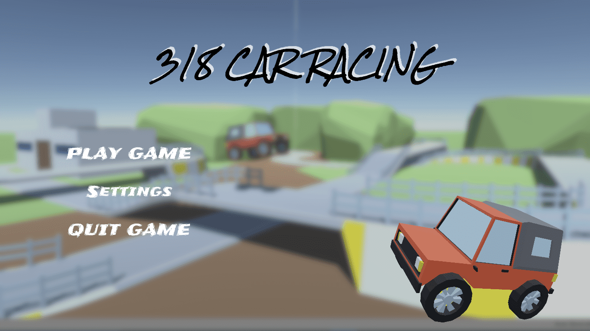
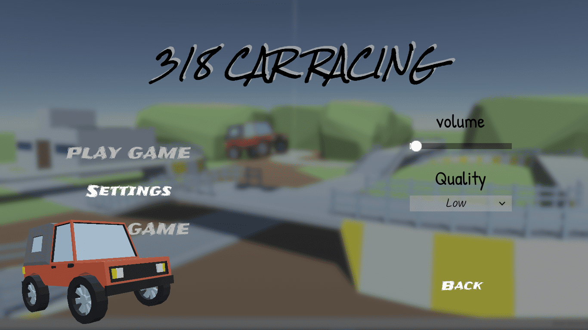
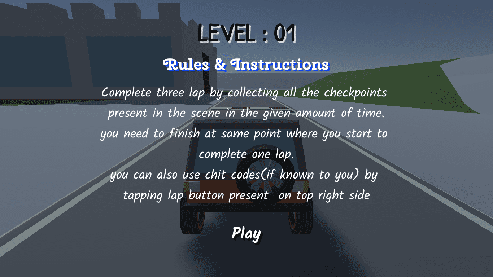
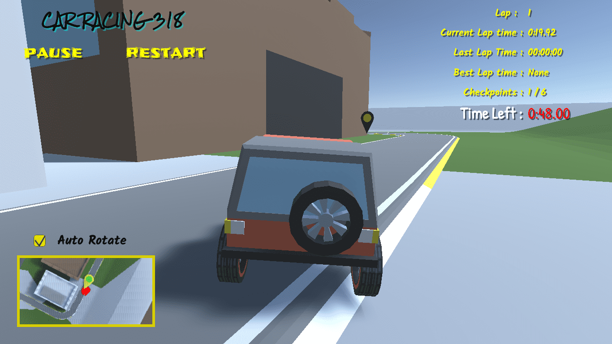
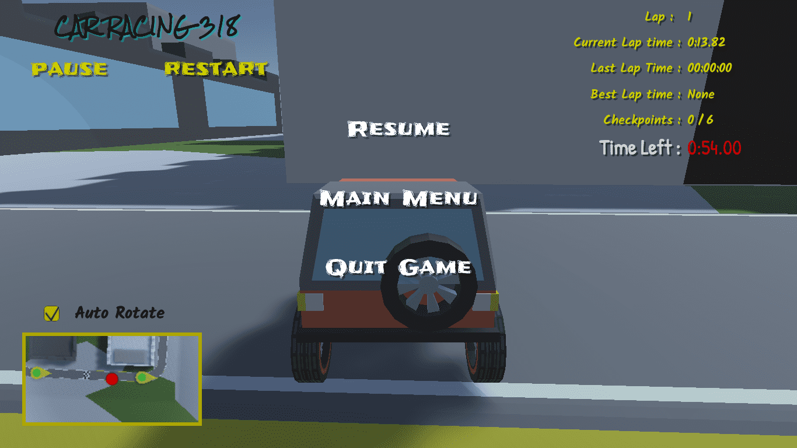
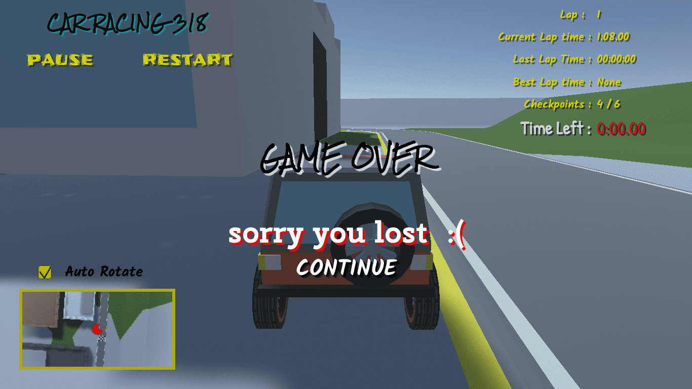

# 318 CAR RACING
This game is called **318_Car_Racing game**, and is based upon simple low poly 3D car
racing game. The 318_Car_Racing is single player game in which main player have to
finish the race in given limited amount of time to win the race.

The main software used in development of the game is **Unity Game Engine**. As the game contains various low poly 3D models the software
used for 3D modeling is **Blender 2.8**, and Visual Studio as code editor. The
scripting of all the game assets is done in C# programming language.

  

## Screenshots

>**Main Menu**

  

>**Settings Menu**

  

>**Level Info Screen**

  

>**Game View**

  

>**Pause Menu**

  

>**Game Over Screen**

